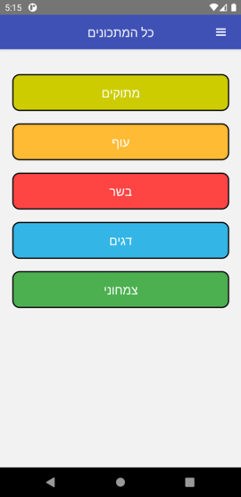
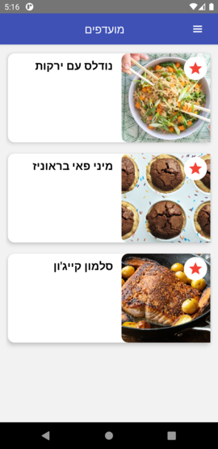
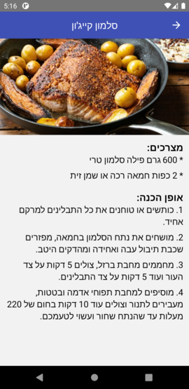
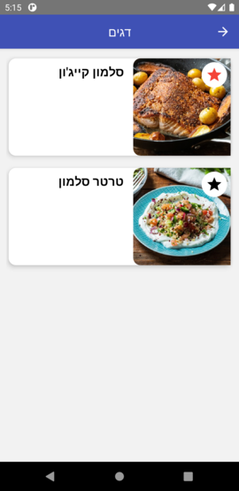

# Recipes App

Simple recipes' app written with [React Native](https://reactnative.dev)

#### Demo App
You can download the (Android) demo app [here](output/demo_app.apk)

## Features

* Adding new recipe
* Showing recipes by category
* Search Recipes by ingredients
* Keep favourites recipes list

## Tech details

* **State management**: [MobX](https://mobx.js.org)
* **Backend**: Firebase (Baas)  
* **HTTP**: Using [axios](https://www.npmjs.com/package/axios)   
* **Performance**: Using [Hermes](https://reactnative.dev/docs/hermes) Engine (Android Only)

## Screenshots

* Home Screen

* Category's Recipes Screen

* Recipe Details Screen:

* Favourites Details Screen:

